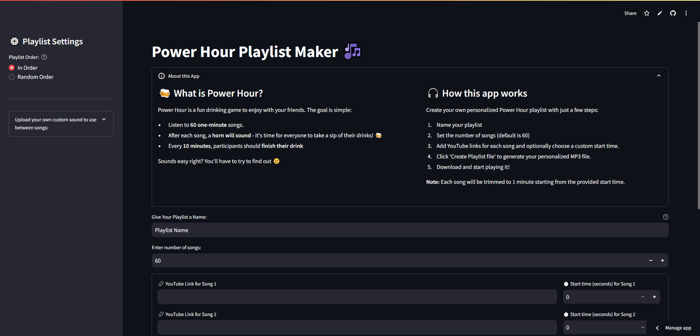

<div align="center">
  <div id="user-content-toc">
    <ul>
      <summary><h1 style="display: inline-block;">🎵 Power Hour Playlist Maker 🎵</h1></summary>
    </ul>
  </div>

</div>

<div align="center">
      <a href="https://power-hour.streamlit.app/"></a>

</div>
<br>
<hr>



Welcome to the **Power Hour Playlist Maker**! This app allows you to create a fun and personalized playlist for the classic drinking game "Power Hour." Easily download audio clips from YouTube, trim them to one-minute snippets, and generate a ready-to-use playlist for your party.

---

## 🍻 What is Power Hour?
Power Hour is a fun drinking game enjoyed with friends. Here's how it works:
- Listen to 60 one-minute songs.
- After each song, a horn will sound—indicating it's time for everyone to take a sip of their drink. 🍻
- Every 10 minutes, participants should finish their drink.

Sounds simple? You'll have to try it to see how challenging it can get! 😄


---

## 🎧 How It Works
The **Power Hour Playlist Maker** streamlines the process of creating a playlist for the game. Here's what you need to do:

1. **Name Your Playlist**: Give your playlist a unique and descriptive name.
2. **Set the Number of Songs**: Choose how many songs you want in the playlist (default is 60).
3. **Add YouTube Links**: Provide the YouTube links for each song and optionally select a custom start time for each clip.
4. **Generate Your Playlist**: Click the "Generate Playlist" button to create a personalized MP3 file.
5. **Download and Enjoy**: Download the MP3 file and get ready for an exciting Power Hour!

**Note:** Each song will be trimmed to one minute, starting from the provided start time.

---

## 💻 Features
- **YouTube Integration**: Fetch and download audio clips directly from YouTube.
- **Custom Sound Effects**: Replace the default transition sound ("tchica_tchica") with your custom upload.
- **Flexible Playlist Order**: Choose between "In Order" or "Shuffle" for song playback.
- **User-Friendly Interface**: Intuitive inputs for playlist creation and song customization.
- **Downloadable MP3 File**: Generate a high-quality MP3 file ready for your game.

---

## 🛠️ Installation
Follow these steps if you want to set up and run the app on your machine:

1. **Clone the Repository**:
   ```bash
   git clone https://github.com/your-username/power-hour-playlist-maker.git
   cd power-hour-playlist-maker
   ```

2. **Install Dependencies**:
   Ensure you have Python 3.8+ installed. Install the required dependencies:
   ```bash
   pip install -r requirements.txt
   ```

3. **Run the App**:
   Start the Streamlit app with the following command:
   ```bash
   streamlit run app.py
   ```

4. **Access the App**:
   Open the provided local URL in your web browser (e.g., `http://localhost:8501`).

---

## 🗂️ Project Structure
Here is an overview of the repository's structure:

```plaintext
power_hour_app/
├── app.py                     # Main Streamlit app entry point
├── requirements.txt           # Dependencies list
├── README.md                  # Project documentation
├── config.json                # Configuration file
├── utils/                     # Helper modules and utilities
│   ├── __init__.py
│   ├── audio_processor.py     # Handles audio processing
│   ├── youtube_handler.py     # YouTube download and metadata functions
│   ├── config_manager.py      # Configuration management
│   ├── validations.py         # Validation utilities
├── assets/                    # Static assets
│   ├── sound_clips/           # Default sound clips
│   │   ├── horn.m4a
│   │   ├── tchica_tchica.m4a
│   │   ├── signature_tag.m4a
├── .streamlit/                # Streamlit settings files
│   ├── config.toml            # Configurations for the Streamlit App
```

---

## 🛠️ Configuration
The `config.json` file allows you to customize default settings:

```json
{
    "SOUND_CLIPS_PATH": "assets/sound_clips/",
    "DEFAULT_SONG_DURATION": 60,
    "DEFAULT_NUMBER_SONGS": 60,
    "MAX_NUMBER_SONGS": 90
}
```

---

## 🙋‍♂️ FAQ

### 1. Can I customize the transition sound between songs?
Yes! Use the **Upload Custom Sound** feature in the sidebar to replace the default transition sound.

### 2. What if I don't provide a start time for a song?
If no start time is specified, the song will start from the beginning.

### 3. What formats are supported for custom sound uploads?
Supported formats include `.mp3`, `.wav`, and `.m4a`.

---


### Enjoy your Power Hour! 🍻

